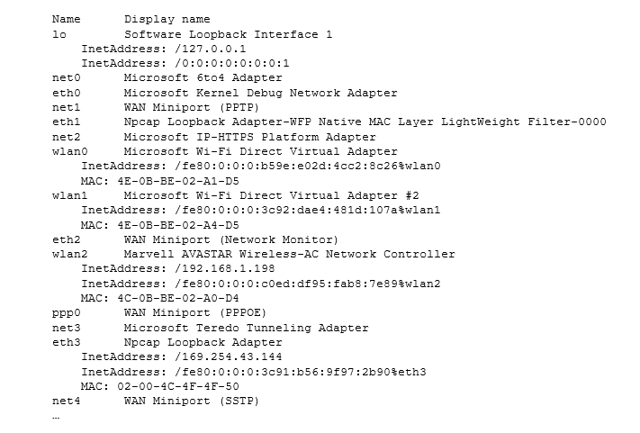

# Programming Lab 2 - Data Link Layer 

The <code>NetworkInterface</code> class provides a mean of accessing the devices that act as a network node. 
<code>NetworkInterface</code> is made up of a name, and a list of IP addresses assigned to this interface. 
Remember that **network interface** is the point of connection between a node and the network.

The <code>NetworkInterface</code> class does not have any constructors. Instead, few static methods are provided to 
return an instance of the <code>NetworkInterface</code> class: 

<code>getByInetAddress</code>: This is used if the IP address is known
 
<code>getByName</code>: Searches for the network interface with the specified name
 
<code>getByIndex</code>: Get a network interface given its index 
 
<code>getNetworkInterfaces</code>: Returns all the interfaces on this machine

In this part of the lab, we will be concentration of using the <code>getNetworkInterfaces</code> to obtain and display
an enumeration of all network interfaces on your machines.

The following code demonstrates how to use the <code>getNetworkInterfaces</code> method to gather and display a list of network 
interfaces for the machine. 

<code>
Enumeration<NetworkInterface> interfaceList = NetworkInterface.getNetworkInterfaces();
for (NetworkInterface element : Collections.list(interfaceList)) {
    System.out.printf("%-8s  %-32s\n", element.getName(), element.getDisplayName());
}
</code>
    
 
<code>getInetAddresses</code>: Provides a convenient method to return an Enumeration with all or a subset of the InetAddresses bound to this network interface.
An <code>InetAddresses</code> represents an Internet Protocol (IP) address. 
 
MAC addresses can be retrieved when needed. The following method returns a string containing the IP address and the MAC address for the <code>NetworkInterface</code> instance. 
The <code>getHardwareAddress</code> method returns a byte array containing the address and element is a <code>NetworkInterface</code> instance. 

<code>
byte[] macBuffer = element.getHardwareAddress(); 
if (macBuffer != null) { 
  for (int i = 0; i < macBuffer.length; i++) { 
    System.out.printf(String.format("%02X%s", macBuffer[i], (i < macBuffer.length - 1) ? "-" : ""));   
  } 
} 
</code>

 

<code>InetAddress.getLocalHost</code>: Returns the IP address string in textual presentation. 

 

### Task 
Use the provided information to obtain and display an enumeration of the network interfaces for the current computer. The output will vary depending on the computer used. For a reference, I see the following on my laptop

### Grading
Post your report including source in [Marmoset](https://cs.ycp.edu/marmoset) by the scheduled due date in the syllabus.
 
